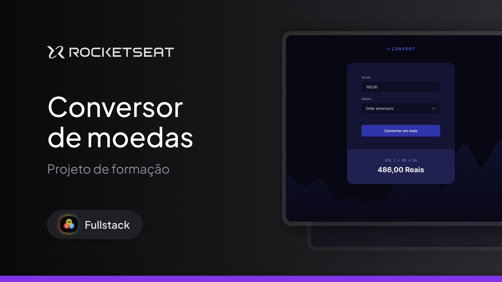

<h1 align="center">💱 Currency Converter</h1>

Project developed during the Rocketseat Full-Stack course.  
A simple and interactive application for real-time currency conversion.

 

  

---

## 🚀 Technologies

This project was developed using the following technologies:

- HTML5
- CSS3
- JavaScript
- Git & GitHub
- Google Fonts

---

## 🖥️ Project

This project is a currency converter that allows users to enter an amount and choose between different international currencies (US Dollar, Euro, and British Pound) to convert automatically into Brazilian Real.

The application features:

- Input validation (accepts numbers only)
- Conversion based on fixed exchange rates
- Dynamic display of results
- Currency formatting in Brazilian Real (R$)

---

## ⚙️ Features

- 💰 Real-time currency conversion
- 🔎 Input field data validation
- 📊 Clear display of exchange rates
- 🎯 Simple and intuitive interface
- 📱 Modern and responsive layout

---

## 🧠 What I Learned

During the development of this project, the following concepts were practiced:

- DOM manipulation
- JavaScript event handling
- Regex for input validation
- Conditional structures
- Reusable functions
- Currency formatting using `toLocaleString`

---

## 📌 Future Improvements

- Integration with a real-time exchange rate API
- Support for more currencies
- Conversion history
- Improved responsiveness for mobile devices
